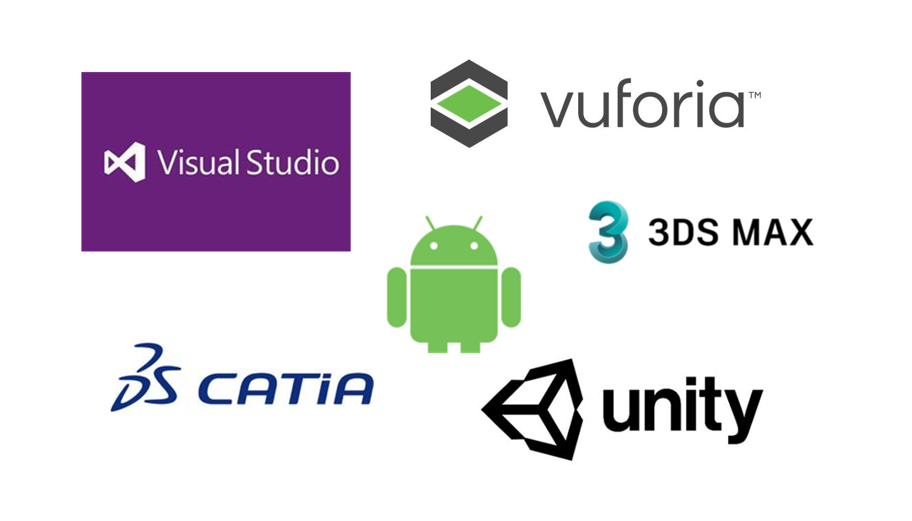

# 项目&作品
项目源码暂时还不能上传，之后会整理上传。
# 航空器维修无人车平台
## 主要功能
截取帧图片上传至服务器，进行双目摄像头测距，以及卷积神经网络测试叶片损伤，并返回相关数据。
## 实现
使用树莓派作为控制板，搭载双目摄像头，摄像头数据传送及截取帧使用MJPG-streamer，Flask作为服务器，后台代码使用Python，前台使用JS，卷积神经网络使用Pytorch，测距使用Matlab作标定，openCV做处理，定位使用百度地图API。
## 工具&框架

## 配置
**运行环境** 
1. Operation System: Mac OS X or Linux or Windows
2. Anaconda 4.2.0
3. Python 3.5.2
4. Flask 0.11.1
4. openCV 4.1.1
5. Pycharm 2017.3.7
6. PyTorch 1.2
7. Raspbian 2019
8. MJPG-Streamer
9. 双目摄像头
## 截图

# 航线维修增强现实系统
## 主要功能
任务接收，维护列表，任务清单，维修手册，维修视频，损伤样本，3D模型展示等主要内容。
## 实现
界面主要使用Unity3d进行开发，代码使用Visual Studio开发，语言为C#，客户端为Android，增强现实插件使用Vuforia，模型使用航空领域常用的建模工具CATIA，并使用3dsMAX进行过渡。
## 工具&框架

## 配置
**运行环境** 
1. Operation System: Android 4.4及以上
2. Unity3d 2017.3.0f3
3. Vuforia 7.5
4. Visual Studio 2017
5. CATIA V5R20
6. 3dsMAX 2018
## 截图

# 民航博物馆
## 主要功能
飞机装卸载，零部件展示，飞行演示，人员导览等功能。
## 实现
使用CATIA建立模型，3DSMax软件进行模型过度，Unity3d平台进行场景创建，开发工具为Visual Studio，代码为C#。
## 工具&框架

## 配置
**运行环境** 
1. Operation System: Windows 7及以上
2. Unity3d 2017.3.0f3
3. Visual Studio 2017
4. CATIA V5R20
5. 3dsMAX 2018
## 截图

